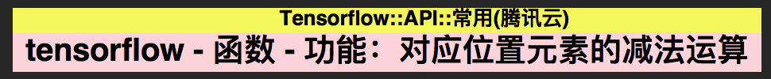
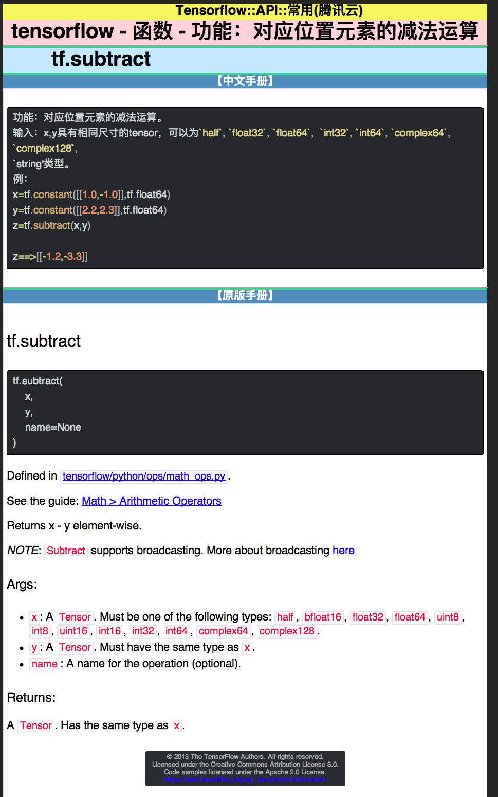
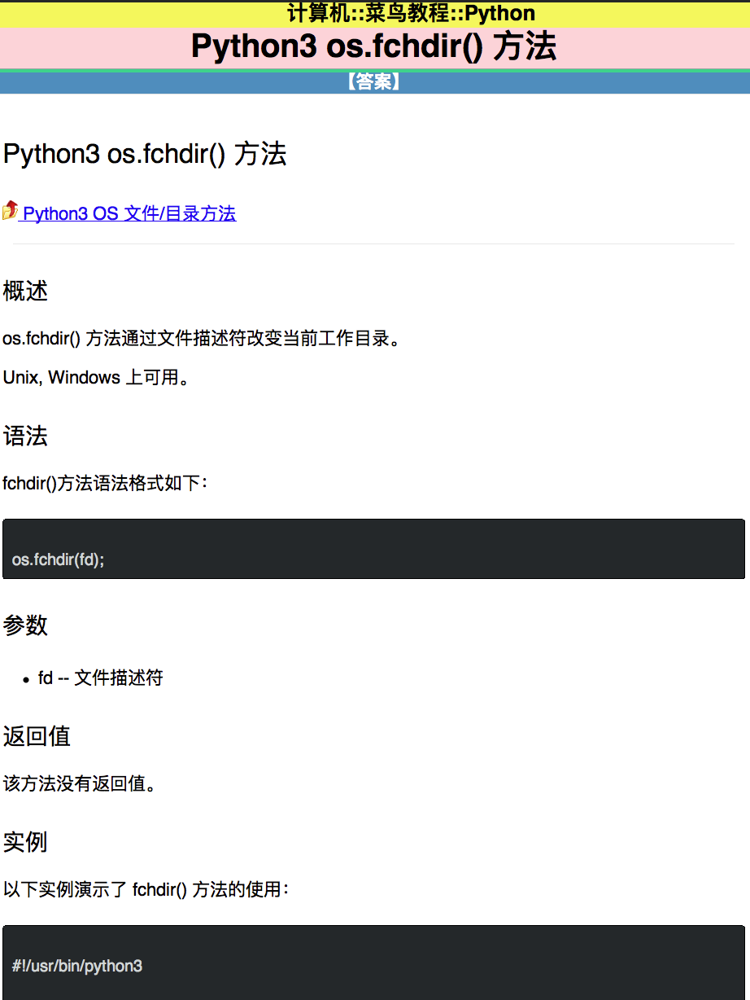

# html2anki

对于学习技术而言, 网络上学习有很多资料和官方文档供我们参考. 其中一些重要的和常用的概念\API\知识点需要我们熟记于心. 本工具的开发初衷, 是为了让刚刚入门的新手, 最大化掌握前人总结的学习资料内容. 将本工具和记忆神器 anki 配合使用, 快速录入权威资料, 免去了手动制卡的一步, 能帮助我们更加高效的学习.

# Quicklook

# 记忆常用 API

## 例子 1

卡片正面

卡片背面

## 例子 2

卡片正面

卡片背面

